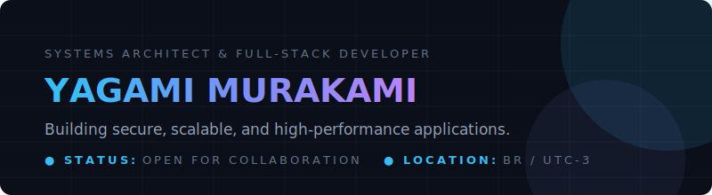

  

## 👋 Olá, eu sou o Yagami Murakami

Sou **Desenvolvedor Python** e **Especialista em Automação de Sistemas** focado em projetar, automatizar e estruturar fluxos de trabalho eficientes, integrações em nuvem (AWS) e scripts avançados em PowerShell e Bash. Convertendo ideias em código funcional enquanto aprendo algo novo todo dia. 🚀

- 🚀 Atualmente desenvolvendo automações com Python e IA aplicadas a negócios e segurança.
- ⚙️ Especialista em desenvolvimento focado em infraestrutura de TI, scripting e Cloud Computing.
- ⚡ Defensor de performance otimizada, código limpo e boas práticas de DevSecOps.

---

### 🛠️ Principais Tecnologias

  

---

### 📂 Projetos em Destaque & Estudos de Caso

Abaixo estão os meus principais projetos ativos no GitHub, com foco em inteligência artificial, automação em nuvem, ferramentas de administração e segurança:

| 🤖 [copiloto-vendas-ia](https://github.com/Yagami-Murakami/copiloto-vendas-ia) | 🎮 [nes-js-puro-v11](https://github.com/Yagami-Murakami/Yagami-Murakami/tree/main/nes-js-puro-v11) |
| :--- | :--- |
| Assistente virtual de vendas baseado em IA para geração de pitches, contorno de objeções comerciais e suporte consultivo em tempo real. | Emulador de NES escrito em JavaScript puro no navegador. Simula ciclos de CPU 6502, rendering PPU por scanline com split scroll (HUD do Mario) e som com Web Audio API. |
| `Python` `AI` `Prompt-Engineering` `API` | `JavaScript` `PPU-Rendering` `CPU-6502` `Web-Audio` |
| [📂 Ver Repositório](https://github.com/Yagami-Murakami/copiloto-vendas-ia) | [📂 Ver Projeto](https://github.com/Yagami-Murakami/Yagami-Murakami/tree/main/nes-js-puro-v11) |

| ⚙️ [PowerShell-Advanced-Support-Tool](https://github.com/Yagami-Murakami/PowerShell-Advanced-Support-Tool) | ☁️ [dio-lambda-s3-automation](https://github.com/Yagami-Murakami/dio-lambda-s3-automation) |
| :--- | :--- |
| Console utilitário avançado para suporte de TI corporativo, contendo automações locais de diagnóstico de SO e duplicação de discos. | Automação e integração Serverless na nuvem AWS, implementando funções Lambda disparadas por eventos de buckets S3. |
| `PowerShell` `Windows` `SysAdmin` `Automation` | `Python` `AWS-Lambda` `Amazon-S3` `Serverless` |
| [📂 Ver Repositório](https://github.com/Yagami-Murakami/PowerShell-Advanced-Support-Tool) | [📂 Ver Repositório](https://github.com/Yagami-Murakami/dio-lambda-s3-automation) |

---

### 📈 Métricas do Ecossistema GitHub

  
  

---

### 📫 Entre em Contato

Sinta-se à vontade para entrar em contato para discutir oportunidades de colaboração, design de sistemas ou desenvolvimento de software:

  
  
  

---

  <i>Desenvolvido com 💻 e ☕ por Yagami Murakami</i>

