# 📟 SYSTEM CONNECTION ESTABLISHED // GIBSON MAINFRAME

<p align="center">
  
</p>

<p align="center">
  
</p>

<p align="center">
  
</p>

---

### 📟 SYSTEM LOGS / WHOAMI

```bash
yagami@gibson:~$ cat operator_profile.log
[+] RUNNER:       Yagami Murakami
[+] ALIAS:        Zero Cool // Acid Burn // Yagami
[+] FIRMWARE:     Linux Kernel 1.9.95-gibson-x64
[+] CLASS:        Full-Stack Cyber Security Engineer
[+] BATTERY:      [████████████████████] 100% (CHARGING)
[+] OBJECTIVE:    Hack the planet and build resilient applications.
```

---

### 🕹️ GIBSON RETRO ARCADE // COME-COME

```bash
yagami@gibson:~$ ./play_arcade.sh --game pacman
Connecting to ROM storage... OK.
Booting Cabinet Emulator...
  
  ᗧ  •  •  •  🍬  •  •  •  👻  👻   [ LEVEL 01 ]

[+] SCORE: 014820  //  [+] HIGH SCORE: 999950  //  [+] STATUS: RUNNING
```

---

### 👥 THE COHORT NETWORK (THE CREW)

```
yagami@gibson:~$ show_active_nodes --crew
OPERATOR             STATUS    SPECIALTY
───────────────────────────────────────────────────────────────
Zero Cool            ACTIVE    Kernel exploits, Dow Jones manipulation
Acid Burn            ACTIVE    Cyberdeck design, high-level compiler optimization
Cereal Killer        ACTIVE    Telephony phreaking, network traffic sniffing
Lord Nikon           ACTIVE    Photographic memory, Gibson 3D data-node mapping
Phantom Phreak       ACTIVE    Dial-tone replication, trunk-line routing bypass
Yagami-Murakami      HOST      Full-stack architectures & Gibson vulnerability scanning
```

---

### ☣️ DA VINCI EXTORTION SCHEME (MALWARE ANALYSIS)

A snippet of the extortion virus injected by **The Plague** into the Ellingson Mineral Corporation mainframe, recovered by our cohort:

```c
/*
 * Da Vinci Virus - Extortion Payload v1.995
 * Targets: Ellingson Mineral Corp ballast automation systems.
 * Objective: Capsize oil fleet unless decryption keys are provided.
 */
#include <ellingson_ballast.h>

void trigger_ballast_overload() {
    int current_tilt = 12;
    int capsize_limit = 45; // Tanker tips over at 45 degrees
    
    while (current_tilt < capsize_limit) {
        flood_ballast_valves(TANKER_FLEET_ID, 11);
        current_tilt += 11;
        
        // Check if operator issues relief valve vent command
        if (check_operator_override() == "VENT") {
            vent_ballast_valves(TANKER_FLEET_ID);
            log_status("BALLAST TANKS VENTED. SYSTEM STABILIZED.");
            return; // Virus bypassed!
        }
    }
    
    capsize_fleet(TANKER_FLEET_ID);
}
```

---

### 🛡️ CYBERNETIC SPECIALTIES (SKILLS)

#### 💻 Programming Languages & Frameworks
<p align="left">
  
  
  
  
  
  
  
  
</p>

#### 🔧 Tools, Database & Cyber Operations
<p align="left">
  
  
  
  
  
  
  
</p>

---

### 📡 ACTIVE CONSOLE OPERATIONS (PROJECTS)

- **📂 [da-vinci-virus](https://github.com/Yagami-Murakami)** — Automated cyberdeck monitoring and terminal layout. `[██████████░░░░░░] 60% Decrypted`
- **📂 [gibson-overload](https://github.com/Yagami-Murakami)** — Subverting the mainframe through parallel port socket injections. `[███████████████░] 90% Compromised`
- **📂 [cookie-monster-bypass](https://github.com/Yagami-Murakami)** — Memory interceptor program designed to pacify malicious warning popups. `[████████████████] 100% Bypassed`

---

### 🕹️ INTERACTIVE PROFILE CONSOLE

Want to hack the Gibson yourself? Grab your cyberdeck and run this sequence in your local terminal:

```bash
# Clone this operator node
git clone https://github.com/Yagami-Murakami/Yagami-Murakami.git

# Enter the node
cd Yagami-Murakami

# Authorize the script execution
chmod +x hack_gibson.sh

# Run the mainframe bypass sequence
./hack_gibson.sh
```

> [!TIP]
> **Windows Operator?** Open PowerShell and initiate the terminal override using this instruction:
> ```powershell
> powershell -ExecutionPolicy Bypass -File .\hack_gibson.ps1
> ```

---

### 📊 CYBER DECK PERFORMANCE STATS

<p align="center">
  <a href="https://github.com/Yagami-Murakami">
    
  </a>
  <a href="https://github.com/Yagami-Murakami">
    
  </a>
</p>

---

<p align="center">
  <i>"Mess with the best, die like the rest. Hack the planet!" - 1995</i>
</p>
