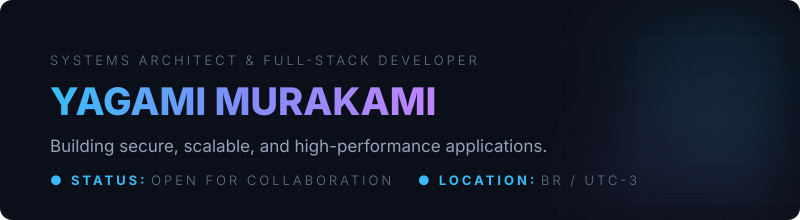

  

<h2 align="center">👋 Olá, eu sou o Yagami Murakami</h2>

  <b>Desenvolvedor Python • Automação de Sistemas • Infraestrutura • Cloud • DevSecOps</b>

  Transformo processos manuais em soluções automatizadas, integro serviços em nuvem e desenvolvo ferramentas voltadas para produtividade, infraestrutura e segurança.

  
  
  

---

### 🎯 Em destaque agora

| 🚀 Construindo | 🧠 Aprimorando | ⚙️ Explorando |
| :--- | :--- | :--- |
| Automações com **Python e IA** aplicadas a negócios e segurança | **Cloud, Linux, redes, scripting e segurança** | Integração entre **software, infraestrutura e automação** |

---

<h3 align="center">🛠️ Stack principal</h3>

  
<b>Linguagens & Scripting</b>

  

    
  

  
<b>Backend, Dados & Automação</b>

  

    
  

  
<b>Cloud, Sistemas & Ferramentas</b>

  

    
  

---

### 📂 Projetos em destaque

| 🤖 [copiloto-vendas-ia](https://github.com/Yagami-Murakami/copiloto-vendas-ia) | 🎮 [nes-js-puro-v11](https://github.com/Yagami-Murakami/nes-js-puro-v11) |
| :--- | :--- |
| Assistente virtual de vendas com IA para geração de pitches, tratamento de objeções e suporte consultivo em tempo real. | Emulador de NES em JavaScript puro com interface CRT, suporte a ZIP/7-Zip via WebAssembly, áudio chiptune e múltiplos mappers. |
| `Python` `IA` `Prompt Engineering` `API` | `JavaScript` `WebAssembly` `PPU` `Web Audio` |
| [📁 Ver projeto](https://github.com/Yagami-Murakami/copiloto-vendas-ia) | [📁 Ver projeto](https://github.com/Yagami-Murakami/nes-js-puro-v11) |

| ⚙️ [PowerShell-Advanced-Support-Tool](https://github.com/Yagami-Murakami/PowerShell-Advanced-Support-Tool) | ☁️ [dio-lambda-s3-automation](https://github.com/Yagami-Murakami/dio-lambda-s3-automation) |
| :--- | :--- |
| Ferramenta avançada de suporte técnico para Windows, com diagnóstico, automações administrativas e rotinas de duplicação de discos. | Projeto Serverless na AWS com funções Lambda acionadas por eventos do Amazon S3. |
| `PowerShell` `Windows` `SysAdmin` `Automation` | `Python` `AWS Lambda` `Amazon S3` `Serverless` |
| [📁 Ver projeto](https://github.com/Yagami-Murakami/PowerShell-Advanced-Support-Tool) | [📁 Ver projeto](https://github.com/Yagami-Murakami/dio-lambda-s3-automation) |

---

### 🧪 Laboratório & Infraestrutura

Além do desenvolvimento de software, mantenho um laboratório próprio para estudos práticos de virtualização, redes, serviços Linux e automação de infraestrutura.

  
  
  
  

  
  
  
  
  

---

### 📚 Aprendizado contínuo

  
  
  
  
  
  

---

### 🐍 Atividade no GitHub

  

  <a href="https://github.com/Yagami-Murakami">Atividade e contribuições</a>
  &nbsp;•&nbsp;
  <a href="https://github.com/Yagami-Murakami?tab=repositories">Todos os repositórios</a>
  &nbsp;•&nbsp;
  <a href="https://github.com/Yagami-Murakami#user-activity-overview">Projetos em destaque</a>

---

### 📫 Entre em contato

  
  
  

---

  <b>Automação, infraestrutura e código para resolver problemas reais.</b>

  <i>Desenvolvido com 💻 e ☕ por Yagami Murakami</i>

